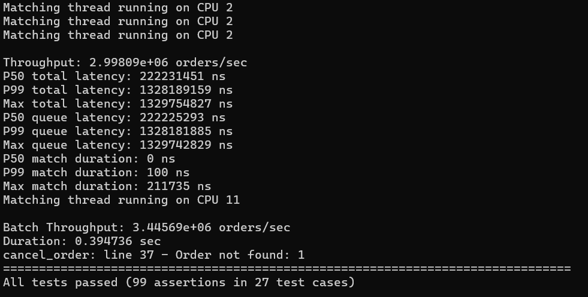

# Low-Latency Matching Engine

A high-performance order matching engine written in C++20, designed for low-latency trading applications. Features lock-free queues, custom memory pools, price-time priority matching, and comprehensive latency measurement.

## Features

- **Price-Time Priority Matching** – Implements standard exchange matching logic
- **Lock-Free MPSC Ring Buffer** – Multi-producer single-consumer queue for order ingress
- **Custom Memory Pools** – Pre-allocated object pools with LRU recycling, zero dynamic allocation during runtime
- **Latency Measurement** – Per-trade total, queue, and match latency collection with percentile statistics
- **Batch Processing** – Configurable batch sizes for improved throughput
- **CPU Affinity** – Pin matching thread to dedicated core (Linux)
- **Asynchronous Logging** – Non-blocking log writer using lock-free queue
- **Market Data Publishing** – Observer pattern for trade and market data events
- **Comprehensive Testing** – 27 test cases including benchmarks using Catch2

## Architecture
┌────────────────────────────────────────────────────────────────────┐
│                         MatchingEngineThread                        │
│  ┌─────────────────────────────────────────────────────────────┐   │
│  │                                                              │   │
│  │   ┌──────────────┐      ┌──────────────────────┐           │   │
│  │   │ OrderIngress │─────▶│   MatchingEngine     │           │   │
│  │   │              │      │                      │           │   │
│  │   │ ┌──────────┐ │      │ ┌─────────────────┐  │           │   │
│  │   │ │MPSCQueue │ │      │ │  order_book     │  │           │   │
│  │   │ │RingBuffer│ │      │ │  (bids/asks)    │  │           │   │
│  │   │ └──────────┘ │      │ └─────────────────┘  │           │   │
│  │   └──────────────┘      │ ┌─────────────────┐  │           │   │
│  │                         │ │  LatencyCollector│  │           │   │
│  │                         │ └─────────────────┘  │           │   │
│  │                         └──────────┬───────────┘           │   │
│  │                                    │                        │   │
│  │                                    ▼                        │   │
│  │                         ┌──────────────────────┐           │   │
│  │                         │  TradeEventListener  │           │   │
│  │                         │       (Observer)     │           │   │
│  │                         └──────────┬───────────┘           │   │
│  │                                    │                        │   │
│  │              ┌─────────────────────┼─────────────────────┐  │   │
│  │              ▼                     ▼                     ▼  │   │
│  │   ┌──────────────────┐  ┌──────────────────┐  ┌────────────┐│   │
│  │   │   TradeLogger    │  │TradeDataPublisher│  │   Future   ││   │
│  │   │                  │  │                  │  │  Extensions││   │
│  │   │ ┌──────────────┐ │  │ ┌──────────────┐ │  │            ││   │
│  │   │ │ AsyncLogger  │ │  │ │MarketDataEvent││  │            ││   │
│  │   │ │ (lock-free)  │ │  │ │   (best_bid,  ││  │            ││   │
│  │   │ └──────────────┘ │  │ │    best_ask,  ││  │            ││   │
│  │   └──────────────────┘  │ │   last_trade) ││  │            ││   │
│  │                         │ └──────────────┘│  │            ││   │
│  │                         └──────────────────┘  └────────────┘│   │
│  └─────────────────────────────────────────────────────────────┘   │
└────────────────────────────────────────────────────────────────────┘

## Key Components

| Component | Description |
|-----------|-------------|
| `MatchingEngine` | Core matching logic with price-time priority |
| `RingBuffer<T>` | Lock-free MPSC queue with cache-aligned head/tail |
| `MemoryPool<T>` | Fixed-size object pool with O(1) allocation |
| `LRUPool<T>` | Memory pool with LRU recycling policy |
| `LatencyCollector` | Percentile (P50/P99) and max latency statistics |
| `AsyncLogger` | Non-blocking file logger |
| `TradeEventListener` | Observer interface for trade events |

## Performance Benchmarks

Results from running on a dedicated CPU core (Linux):

| Metric | Value |
|--------|-------|
| **Throughput (Standard)** | 3 million orders/sec |
| **Throughput (Batch)** | 3.45 million orders/sec |
| **P50 Queue Latency** | 222.23 ms |
| **P99 Queue Latency** | 1328.18 ms |
| **Max Queue Latency** | 1329.74 ms |
| **P50 Match Duration** | 0 ns (below measurement resolution) |
| **P99 Match Duration** | 100 ns |
| **Max Match Duration** | 211.7 µs |
| **P50 Total Latency (end to end)** | 222.23 ms |
| **P99 Total Latency (end to end)** | 1328.19 ms |

*Test configuration: 5 million trade pairs (10 million orders)*

## Building

### Prerequisites

- C++20 compatible compiler (GCC 13, G++ 13)
- CMake 3.10+
- Linux (for CPU affinity) – other platforms fall back gracefully

# Updated Version 2

## Architecture
┌─────────────────────────────────────────────────────────────────────────────┐
│                             INPUT LAYER                                     │
│  ┌───────────────────────────────────────────────────────────────────────┐  │
│  │                                                                        │  │
│  │   ┌────────────────────┐          ┌─────────────────────────┐        │  │
│  │   │   OrderIngress     │──────────▶│  OrderIngress::submit  │        │  │
│  │   │                    │          │                         │        │  │
│  │   │  ┌──────────────┐  │          │  ┌───────────────────┐ │        │  │
│  │   │  │  MPSCQueue   │  │          │  │   Order Object    │ │        │  │
│  │   │  │  RingBuffer  │  │          │  │  (GTC/IOC/FOK/   │ │        │  │
│  │   │  │  (Lock-free) │  │          │  │   GTD/GTT/DAY)   │ │        │  │
│  │   │  └──────────────┘  │          │  └───────────────────┘ │        │  │
│  │   └────────────────────┘          └─────────────────────────┘        │  │
│  │                                                                        │  │
│  └───────────────────────────────────────────────────────────────────────┘  │
└─────────────────────────────────────────────────────────────────────────────┘
                                      │
                                      ▼
┌─────────────────────────────────────────────────────────────────────────────┐
│                          CORE ENGINE LAYER                                  │
│  ┌───────────────────────────────────────────────────────────────────────┐  │
│  │                                                                        │  │
│  │   ┌──────────────────────────────────────────────────────────────┐    │  │
│  │   │              MatchingEngineThread (Worker Thread)             │    │  │
│  │   │                                                               │    │  │
│  │   │  ┌─────────────────────────────────────────────────────────┐ │    │  │
│  │   │  │                  MatchingEngine                         │ │    │  │
│  │   │  │                                                         │ │    │  │
│  │   │  │  ┌───────────────────┐    ┌─────────────────────────┐  │ │    │  │
│  │   │  │  │     Order Book    │    │    Order Book (Asks)    │  │ │    │  │
│  │   │  │  │      (Bids)       │    │    (Price: Ascending)   │  │ │    │  │
│  │   │  │  │ (Price:Descending)│    │                         │  │ │    │  │
│  │   │  │  │                   │    │  ┌───────────────────┐  │  │ │    │  │
│  │   │  │  │  ┌─────────────┐  │    │  │   Price Level    │  │  │ │    │  │
│  │   │  │  │  │ Price Level │  │    │  │   (100.50)       │  │  │ │    │  │
│  │   │  │  │  │   (100.00)  │  │    │  │  ┌─────────────┐ │  │  │ │    │  │
│  │   │  │  │  │  ┌───────┐  │  │    │  │  │  Order 1    │ │  │  │ │    │  │
│  │   │  │  │  │  │Order 1│  │  │    │  │  │  Order 2    │ │  │  │ │    │  │
│  │   │  │  │  │  │Order 2│  │  │    │  │  │  Order 3    │ │  │  │ │    │  │
│  │   │  │  │  │  │Order 3│  │  │    │  │  └─────────────┘ │  │  │ │    │  │
│  │   │  │  │  │  └───────┘  │  │    │  └───────────────────┘  │  │ │    │  │
│  │   │  │  │  └─────────────┘  │    └─────────────────────────┘  │ │    │  │
│  │   │  │  └───────────────────┘                                 │ │    │  │
│  │   │  │                                                         │ │    │  │
│  │   │  │  ┌─────────────────────────────────────────────────────┐│ │    │  │
│  │   │  │  │          ExpiryScheduler (Time Wheel)              ││ │    │  │
│  │   │  │  │  ┌─────────────────┐      ┌─────────────────────┐  ││ │    │  │
│  │   │  │  │  │   Daily Wheel   │      │   Second Wheel      │  ││ │    │  │
│  │   │  │  │  │   (366 slots)   │      │   (86400 slots)     │  ││ │    │  │
│  │   │  │  │  │  ┌───────────┐  │      │  ┌───────────────┐  │  ││ │    │  │
│  │   │  │  │  │  │  Day 0    │  │      │  │  Second 0     │  │  ││ │    │  │
│  │   │  │  │  │  │  Day 1    │  │      │  │  Second 1     │  │  ││ │    │  │
│  │   │  │  │  │  │  Day 2    │  │      │  │  Second 2     │  │  ││ │    │  │
│  │   │  │  │  │  │   ...     │  │      │  │   ...         │  │  ││ │    │  │
│  │   │  │  │  │  │  Day 365  │  │      │  │  Second 86399 │  │  ││ │    │  │
│  │   │  │  │  │  └───────────┘  │      │  └───────────────┘  │  ││ │    │  │
│  │   │  │  │  └─────────────────┘      └─────────────────────┘  ││ │    │  │
│  │   │  │  └─────────────────────────────────────────────────────┘│ │    │  │
│  │   │  └─────────────────────────────────────────────────────────┘ │    │  │
│  │   └──────────────────────────────────────────────────────────────┘    │  │
│  │                                                                        │  │
│  │   ┌──────────────────────────────────────────────────────────────┐    │  │
│  │   │                    Performance Metrics                        │    │  │
│  │   │  ┌─────────────────┐  ┌─────────────────┐  ┌───────────────┐ │    │  │
│  │   │  │ LatencyCollector│  │  Trade Counter  │  │  Memory Pool  │ │    │  │
│  │   │  │  (P50/P99/Max)  │  │  (Atomic)       │  │  (Lock-free)  │ │    │  │
│  │   │  └─────────────────┘  └─────────────────┘  └───────────────┘ │    │  │
│  │   └──────────────────────────────────────────────────────────────┘    │  │
│  └───────────────────────────────────────────────────────────────────────┘  │
└─────────────────────────────────────────────────────────────────────────────┘
                                      │
                                      ▼
┌─────────────────────────────────────────────────────────────────────────────┐
│                            EVENT LAYER                                      │
│  ┌───────────────────────────────────────────────────────────────────────┐  │
│  │                                                                        │  │
│  │   ┌────────────────────┐          ┌─────────────────────────┐        │  │
│  │   │   EventPublisher   │──────────▶│       EventBus          │        │  │
│  │   │                    │          │                         │        │  │
│  │   │  ┌──────────────┐  │          │  ┌───────────────────┐ │        │  │
│  │   │  │ publish()    │  │          │  │  Subscriber List  │ │        │  │
│  │   │  │  TradeEvent  │  │          │  │  (Observer Pattern)│ │        │  │
│  │   │  │  BookUpdate  │  │          │  └───────────────────┘ │        │  │
│  │   │  │  Cancelled   │  │          │                         │        │  │
│  │   │  │  Rejected    │  │          │  ┌───────────────────┐ │        │  │
│  │   │  └──────────────┘  │          │  │  Event Filtering  │ │        │  │
│  │   └────────────────────┘          │  │  (interested_in)  │ │        │  │
│  │                                   │  └───────────────────┘ │        │  │
│  │                                   └───────────┬─────────────┘        │  │
│  └───────────────────────────────────────────────┼───────────────────────┘  │
└─────────────────────────────────────────────────┼───────────────────────────┘
                                                  │
                    ┌─────────────────────────────┼─────────────────────────────┐
                    │                             │                             │
                    ▼                             ▼                             ▼
┌───────────────────────────┐ ┌──────────────────────────┐ ┌──────────────────────────┐
│     CONSUMERS &           │ │     CONSUMERS &          │ │     CONSUMERS &          │
│     PERSISTENCE           │ │     PERSISTENCE          │ │     PERSISTENCE          │
│                           │ │                          │ │                          │
│  ┌─────────────────────┐  │ │  ┌─────────────────────┐ │ │  ┌─────────────────────┐ │
│  │   TradeLogger       │  │ │  │  MarketDataService  │ │ │  │   TextWriter        │ │
│  │                     │  │ │  │                     │ │ │  │                     │ │
│  │  ┌───────────────┐  │  │ │  │  ┌───────────────┐  │ │ │  │  ┌───────────────┐  │ │
│  │  │  on_event()   │  │  │ │  │  │  on_event()   │  │ │ │  │  │  on_event()   │  │ │
│  │  │  (TradeEvent) │  │  │ │  │  │ (BookUpdate)  │  │ │ │  │  │  (All Events) │  │ │
│  │  └───────────────┘  │  │ │  │  └───────────────┘  │ │ │  │  └───────────────┘  │ │
│  │                     │  │ │  │                     │ │ │  │                     │ │
│  │  ┌───────────────┐  │  │ │  │  ┌───────────────┐  │ │ │  │  ┌───────────────┐  │ │
│  │  │  AsyncLogger  │  │  │ │  │  │  latest()     │  │ │ │  │  │  Journal File │  │ │
│  │  │  (Non-block)  │  │  │ │  │  │  Best Bid/Ask │  │ │ │  │  │  (Persistence)│  │ │
│  │  └───────────────┘  │  │ │  │  │  Last Trade   │  │ │ │  │  └───────────────┘  │ │
│  │                     │  │ │  │  └───────────────┘  │ │ │  │                     │ │
│  │  ┌───────────────┐  │  │ │  └─────────────────────┘ │ │  │  ┌───────────────┐  │ │
│  │  │  Trade Log    │  │  │ │                          │ │  │  │  Snapshot     │  │ │
│  │  │  (File)       │  │  │ │                          │ │  │  │  Service      │  │ │
│  │  └───────────────┘  │  │ │                          │ │  │  │  (State Save) │  │ │
│  └─────────────────────┘  │ │                          │ │  │  └───────────────┘  │ │
│                           │ │                          │ │  │                     │ │
│                           │ │                          │ │  │  ┌───────────────┐  │ │
│                           │ │                          │ │  │  │  ReplayEngine │  │ │
│                           │ │                          │ │  │  │  (Recovery)   │  │ │
│                           │ │                          │ │  │  └───────────────┘  │ │
│                           │ │                          │ │  └─────────────────────┘ │
└───────────────────────────┘ └──────────────────────────┘ └──────────────────────────┘
                    │                             │                             │
                    └─────────────────────────────┼─────────────────────────────┘
                                                  │
                                                  ▼
┌─────────────────────────────────────────────────────────────────────────────┐
│                         INFRASTRUCTURE LAYER                               │
│  ┌───────────────────────────────────────────────────────────────────────┐  │
│  │                                                                        │  │
│  │   ┌────────────────────┐  ┌────────────────────┐  ┌───────────────┐  │  │
│  │   │    RingBuffer      │  │    MemoryPool      │  │  AsyncLogger  │  │  │
│  │   │                    │  │                    │  │               │  │  │
│  │   │  ┌──────────────┐  │  │  ┌──────────────┐  │  │ ┌───────────┐ │  │  │
│  │   │  │ Lock-free    │  │  │  │ Pre-allocated│  │  │ │Background │ │  │  │
│  │   │  │ MPSC Queue   │  │  │  │ Object Pool  │  │  │ │ Thread    │ │  │  │
│  │   │  │ Cache-aligned│  │  │  │ LRU Strategy │  │  │ │ Batch     │ │  │  │
│  │   │  │ Atomic Ops   │  │  │  │ Type-safe    │  │  │ │ Write     │ │  │  │
│  │   │  └──────────────┘  │  │  └──────────────┘  │  │ └───────────┘ │  │  │
│  │   └────────────────────┘  └────────────────────┘  └───────────────┘  │  │
│  │                                                                      │  │
│  │   ┌────────────────────┐  ┌────────────────────┐  ┌───────────────┐  │  │
│  │   │  CPU Affinity      │  │  CacheAligned      │  │  Clock        │  │  │
│  │   │                    │  │                    │  │               │  │  │
│  │   │  ┌──────────────┐  │  │  ┌──────────────┐  │  │ ┌───────────┐ │  │  │
│  │   │  │ Pin Thread   │  │  │  │ False Sharing│  │  │ │ now_ns()  │ │  │  │
│  │   │  │ to Core      │  │  │  │ Prevention   │  │  │ │ Timestamp │ │  │  │
│  │   │  │ (Linux)      │  │  │  │ (64-byte     │  │  │ └───────────┘ │  │  │
│  │   │  └──────────────┘  │  │  │  alignment)  │  │  │               │  │  │
│  │   └────────────────────┘  │  └──────────────┘  │  │               │  │  │
│  │                            └────────────────────┘  └───────────────┘  │  │
│  └───────────────────────────────────────────────────────────────────────┘  │
└─────────────────────────────────────────────────────────────────────────────┘

## Key Components

Component	Description
`MatchingEngine`	Core matching logic with price-time priority
`MatchingEngineThread`	Worker thread with batch processing and CPU affinity
`ExpiryScheduler`	Time-wheel based order expiration manager
`EventBus`	Central event dispatcher with observer pattern
`EventPublisher`	Event publishing interface with timestamp generation
`RingBuffer<T>`	Lock-free MPSC queue with cache-aligned head/tail
`MemoryPool<T>`	Fixed-size object pool with O(1) allocation
`LRUPool<T>`	Memory pool with LRU recycling policy
`LatencyCollector`	Percentile (P50/P99) and max latency statistics
`AsyncLogger`	Non-blocking file logger with background thread
`OrderIngress`	Order submission entry point with MPSC queue
`TextWriter`	Event persistence to journal file
`SnapshotService`	Order book state snapshot capture
`ReplayEngine`	System recovery from journal + snapshots
`PriceLevel`	Order book price node with doubly-linked list
`Order`	Core order data structure with expiry support
`CacheAligned<T>`	False-sharing prevention with 64-byte alignment
`pin_thread_to_core`	CPU affinity utility for Linux platforms

## Performance Benchmarks

Results from running on a dedicated CPU core (Linux):

| Metric | Value |
|--------|-------|
| **Throughput (Standard)** | 4.06 million orders/sec |
| **Throughput (Batch)** | 4.38 million orders/sec |
| **P50 Queue Latency** | 218.71 ms |
| **P99 Queue Latency** | 468.08 ms |
| **Max Queue Latency** | 470.11 ms |
| **P50 Match Duration** | 0 ns (below measurement resolution) |
| **P99 Match Duration** | 100 ns |
| **Max Match Duration** | 69.1 µs |
| **P50 Total Latency (end to end)** | 218.71 ms |
| **P99 Total Latency (end to end)** | 468.08 ms |

*Test configuration: 5 million trade pairs (10 million orders)*

## What's new

- Change order books from std::map<intrusive list> to std::vector<intrusive list>
- Supports different types of order: GTC, GTD, GTT, DAY, IOC, FOK
- Use time wheel to manage orders with expiry time
- Abstract event bus from matching engine and extend different events
- Persistence and replay for matching results (being done)
- Snapshot and replay for order books (being done)

# By Jeremy